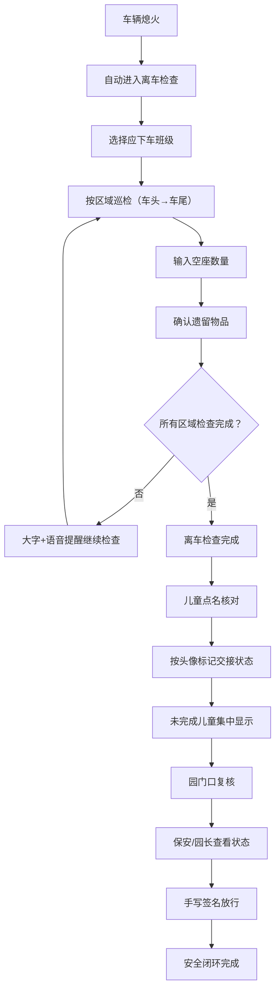

## 1. 产品概述

校车儿童滞留巡检终端是一款安装在校车内平板上的安全管理应用，主要服务于低龄学生多、上下车秩序复杂的幼儿园校车场景。通过离车检查、儿童点名核对、园门口复核三大核心功能，构建现场化、少打字的安全闭环，有效预防儿童滞留校车事故的发生。

## 2. 核心功能

### 2.1 用户角色

| 角色 | 使用场景 | 核心权限 |
|------|----------|----------|
| 随车老师 | 车内巡检、儿童交接 | 执行离车检查、儿童点名核对 |
| 保安/值班园长 | 园门口复核 | 查看清车状态、签名放行 |

### 2.2 功能模块

1. **首页/主菜单**: 三大功能入口（离车检查、儿童点名、园门口复核）、车辆状态显示、当前时间
2. **离车检查页面**: 班级选择、分区巡检（车头→车尾）、空座数量输入、遗留物确认、未检查项大字+语音提醒
3. **儿童点名核对页面**: 儿童头像列表、快速状态标记（已交家长/已进班/临时请假）、未完成交接集中显示
4. **园门口复核页面**: 清车状态查看、签名确认、放行记录

### 2.3 页面详情

| 页面名称 | 模块名称 | 功能描述 |
|-----------|-------------|---------------------|
| 首页 | 功能入口卡片 | 三大功能的大按钮入口，含图标和文字说明 |
| 首页 | 车辆状态栏 | 显示车牌号、当前时间、车辆状态（熄火/运行） |
| 离车检查 | 班级选择 | 多选按钮选择本趟应下车的班级 |
| 离车检查 | 区域巡检引导 | 按顺序显示检查区域（车头、前区、中区、后区、车尾、过道、座椅缝隙） |
| 离车检查 | 空座数量输入 | 大按钮数字输入器（0-10）确认当前区域空座数 |
| 离车检查 | 遗留物确认 | 书包、水杯、外套等遗留物勾选确认 |
| 离车检查 | 未检查提醒 | 全屏大字红色警告+语音播报"请继续检查" |
| 儿童点名 | 儿童头像网格 | 按班级分组显示儿童头像和姓名 |
| 儿童点名 | 状态快速标记 | 点击头像弹出状态选择（已交家长/已进班/临时请假） |
| 儿童点名 | 未完成列表 | 底部集中显示未完成交接的儿童 |
| 园门口复核 | 清车状态总览 | 显示检查完成情况、未检查区域、点名完成率 |
| 园门口复核 | 签名板 | 手写签名区域，支持清除和确认 |
| 园门口复核 | 放行记录 | 显示放行时间、签名人、车牌号等信息 |

## 3. 核心流程

随车老师到达幼儿园后，车辆熄火触发系统自动进入离车检查界面。老师先选择本趟班级，然后按照引导从车头走到车尾依次检查每个区域，输入空座数并确认遗留物。若存在未检查区域，系统持续大字+语音提醒。完成离车检查后，老师切换到儿童点名页面，按儿童头像快速标记交接状态。最后保安或园长在园门口使用同一终端查看清车和点名状态，签名确认后放行，形成完整的安全闭环。

## 4. 用户界面设计

### 4.1 设计风格

- **主色调**: 温暖的橙黄色系（#FF6B35）搭配安全警示红（#E63946）和安全确认绿（#2A9D8F）
- **辅助色**: 深海军蓝（#1D3557）作为背景深色，米白色（#F1FAEE）作为背景浅色
- **按钮风格**: 大圆角（16-24px）、立体阴影、大点击区域（适合触控操作）
- **字体**: 大号圆体字，标题32-48px，正文20-28px，强调数字48-72px（适合车内环境和中老年用户）
- **布局风格**: 卡片式布局，大间距，极简设计，减少视觉干扰
- **图标风格**: 圆润可爱的emoji和Lucide图标结合，符合幼儿园场景

### 4.2 页面设计概述

| 页面名称 | 模块名称 | UI元素 |
|-----------|-------------|-------------|
| 首页 | 功能入口卡片 | 大卡片网格、渐变色背景、图标+大号文字、入场动画 |
| 离车检查 | 区域巡检引导 | 步骤进度条、当前区域放大显示、前后区域预览、过渡动画 |
| 离车检查 | 数字输入器 | 圆形大按钮、数字跳动动画、确认按钮脉冲效果 |
| 离车检查 | 警告提醒 | 全屏红色闪烁、文字缩放动画、语音播报标识 |
| 儿童点名 | 头像网格 | 圆角头像卡片、状态角标、选中高亮、班级分组标题 |
| 园门口复核 | 签名板 | 画布绘制区域、清除/确认按钮、签名预览 |

### 4.3 响应式

- 平板横屏优先设计（1024x768及以上）
- 触控友好：所有可点击元素最小80x80px
- 大字体、高对比度，适应车内光线变化
- 支持横竖屏切换自适应

