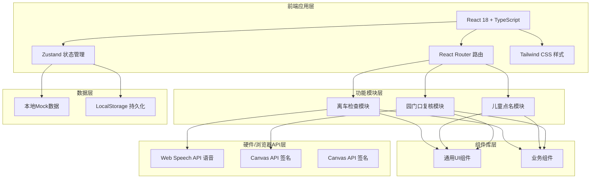

## 1. 架构设计



## 2. 技术描述

- **前端框架**: React 18 + TypeScript
- **构建工具**: Vite
- **路由**: react-router-dom
- **状态管理**: zustand
- **样式**: Tailwind CSS 3
- **图标**: lucide-react
- **语音**: Web Speech API (浏览器原生)
- **签名**: Canvas API
- **数据存储**: LocalStorage + Mock数据
- **后端**: 无（纯前端应用，数据本地持久化）

## 3. 路由定义

| Route | 页面名称 | 用途 |
|-------|---------|------|
| / | 首页/主菜单 | 三大功能入口、车辆状态显示 |
| /inspection | 离车检查 | 班级选择、分区巡检、空座输入、遗留物确认 |
| /rollcall | 儿童点名 | 头像列表、状态标记、未完成列表 |
| /review | 园门口复核 | 状态总览、签名板、放行记录 |

## 4. 数据模型

### 4.1 数据模型定义

```mermaid
erDiagram
    BUS {
        string id PK
        string plateNumber
        string driverName
        string status
    }
    CLASS {
        string id PK
        string name
        string color
    }
    CHILD {
        string id PK
        string name
        string classId FK
        string avatar
        enum status
        datetime updatedAt
    }
    INSPECTION_AREA {
        string id PK
        string name
        string icon
        int order
    }
    INSPECTION_RECORD {
        string id PK
        string busId FK
        datetime createdAt
        string inspectorName
        array areasChecked
        int emptySeats
        array leftoverItems
        boolean completed
    }
    ROLLCALL_RECORD {
        string id PK
        string busId FK
        datetime createdAt
        array classIds
        array childrenStatus
        boolean completed
    }
    REVIEW_RECORD {
        string id PK
        string busId FK
        datetime createdAt
        string reviewerName
        string signature
        boolean passed
    }
```

### 4.2 TypeScript 类型定义

```typescript
// 车辆
interface Bus {
  id: string;
  plateNumber: string;
  driverName: string;
  status: 'running' | 'stopped';
}

// 班级
interface Class {
  id: string;
  name: string;
  color: string;
}

// 儿童
interface Child {
  id: string;
  name: string;
  classId: string;
  avatar: string;
  status: 'pending' | 'picked_up' | 'in_class' | 'absent';
  updatedAt?: Date;
}

// 检查区域
interface InspectionArea {
  id: string;
  name: string;
  icon: string;
  order: number;
}

// 区域检查结果
interface AreaCheckResult {
  areaId: string;
  emptySeats: number;
  leftoverItems: string[];
  checked: boolean;
  checkedAt?: Date;
}

// 检查记录
interface InspectionRecord {
  id: string;
  busId: string;
  createdAt: Date;
  inspectorName: string;
  classIds: string[];
  areas: AreaCheckResult[];
  completed: boolean;
  completedAt?: Date;
}

// 点名记录
interface RollcallRecord {
  id: string;
  busId: string;
  createdAt: Date;
  classIds: string[];
  children: { childId: string; status: Child['status'] }[];
  completed: boolean;
  completedAt?: Date;
}

// 复核记录
interface ReviewRecord {
  id: string;
  busId: string;
  createdAt: Date;
  reviewerName: string;
  signature: string; // base64
  inspectionPassed: boolean;
  rollcallPassed: boolean;
  passed: boolean;
}
```

## 5. 项目结构

```
src/
├── components/           # 通用组件
│   ├── ui/              # 基础UI组件
│   │   ├── Button.tsx
│   │   ├── Card.tsx
│   │   └── ProgressBar.tsx
│   ├── inspection/      # 离车检查相关组件
│   │   ├── ClassSelector.tsx
│   │   ├── AreaGuide.tsx
│   │   ├── NumberPad.tsx
│   │   ├── ItemChecker.tsx
│   │   └── WarningOverlay.tsx
│   ├── rollcall/        # 点名相关组件
│   │   ├── ChildCard.tsx
│   │   ├── StatusPicker.tsx
│   │   └── PendingList.tsx
│   └── review/          # 复核相关组件
│       ├── StatusOverview.tsx
│       ├── SignaturePad.tsx
│       └── ReleaseRecord.tsx
├── pages/               # 页面组件
│   ├── Home.tsx
│   ├── Inspection.tsx
│   ├── Rollcall.tsx
│   └── Review.tsx
├── store/               # Zustand状态管理
│   ├── useInspectionStore.ts
│   ├── useRollcallStore.ts
│   └── useReviewStore.ts
├── data/                # Mock数据
│   ├── classes.ts
│   ├── children.ts
│   ├── areas.ts
│   └── bus.ts
├── utils/               # 工具函数
│   ├── speech.ts        # 语音播报
│   ├── storage.ts       # 本地存储
│   └── time.ts          # 时间格式化
├── types/               # 类型定义
│   └── index.ts
├── App.tsx
├── main.tsx
└── index.css
```

